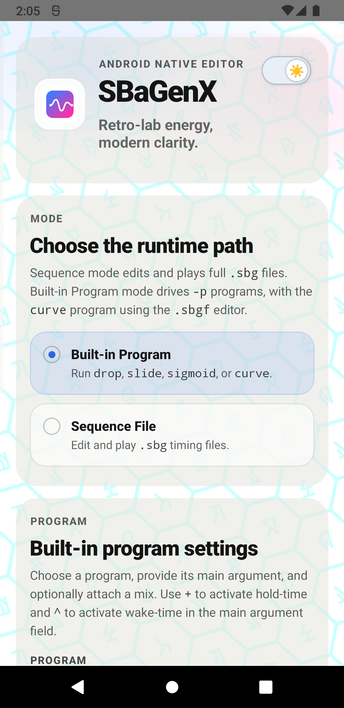

# SBaGenX Android

SBaGenX Android is the mobile frontend for `sbagenxlib`: edit `.sbg` and `.sbgf` documents, validate them natively, preview beat graphs, and play sessions on-device with the same core engine used by desktop SBaGenX.



## What this is

- Android app frontend for the SBaGenX engine
- React Native UI with a Kotlin/JNI native bridge
- Native validation, beat preview, and playback through `sbagenxlib`
- Native mix-input support for WAV, OGG, MP3, and FLAC

## Release channel

This project is currently **alpha/tester-oriented**.

- use the latest APK from the [releases page](https://github.com/lm7137/SBaGenX-Android/releases) if you want to test the app
- expect rapid changes in UI, storage, and native bridge behavior
- if you want the most mature experience today, start with the desktop/core repo: [SBaGenX](https://github.com/lm7137/SBaGenX)

## Try it quickly

### If you want to test the app

- check the [releases page](https://github.com/lm7137/SBaGenX-Android/releases) for the latest APK
- install the latest alpha build
- open a bundled example or create a new `.sbg` / `.sbgf` document

### If you want to build from source

```sh
source ~/.nvm/nvm.sh
nvm use 22
npm start
```

In another terminal:

```sh
source ~/.nvm/nvm.sh
nvm use 22
npm run android
```

## What works today

- native `.sbg` and `.sbgf` validation
- built-in program mode for `drop`, `sigmoid`, `slide`, and `curve`
- native beat-preview plotting sampled from `sbagenxlib`
- on-device playback via `AudioTrack`
- mix-input support for WAV/raw, OGG, MP3, and FLAC
- `SBAGEN_LOOPER` override state and embedded-tag prepopulation
- Android document library storage plus folder/document pickers
- bundled `river1.ogg` and `river2.ogg` app assets for desktop-style examples

## What still needs work

- richer plot coverage beyond beat preview
- export workflows
- more polished product/demo presentation near the top of this repo
- iOS parity

## Ecosystem

- Core CLI, desktop GUI, and shared library: [SBaGenX](https://github.com/lm7137/SBaGenX)
- Android codec vendoring protocol: [`docs/android-codecs.md`](docs/android-codecs.md)
- Native bridge notes: [`docs/android-native-bridge.md`](docs/android-native-bridge.md)
- Vendored engine snapshot provenance: [`native/sbagenxlib/SNAPSHOT.md`](native/sbagenxlib/SNAPSHOT.md)

## Repo layout

- `src/`: React Native UI and JS bridge wrappers
- `android/`: Android app and Kotlin native module wiring
- `native/jni/`: JNI and CMake entry point
- `native/sbagenxlib/`: vendored engine snapshot used by the Android bridge
- `docs/`: Android-specific notes and vendoring protocol

## Contributing

See [`CONTRIBUTING.md`](CONTRIBUTING.md).

Important project rule:

- if a change belongs in the shared engine, land it in the parent `SBaGenX` repo first and then vendor a pinned snapshot into this repo

## Snapshot provenance

The vendored `sbagenxlib` sources and codec archives in this repo are currently pinned to parent `SBaGenX` tag `v3.9.0-alpha.10` at commit `fafdc4fdb0c581fcd31a06dae30154e7829e0327`.

See:

- [`native/sbagenxlib/SNAPSHOT.md`](native/sbagenxlib/SNAPSHOT.md)
- [`docs/android-native-bridge.md`](docs/android-native-bridge.md)
- [`docs/android-codecs.md`](docs/android-codecs.md)
- [`native/sbagenxlib/libs/UPSTREAM.md`](native/sbagenxlib/libs/UPSTREAM.md)
